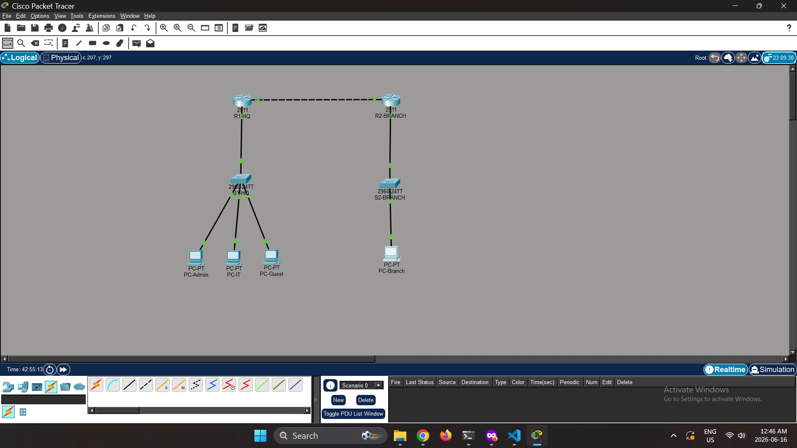
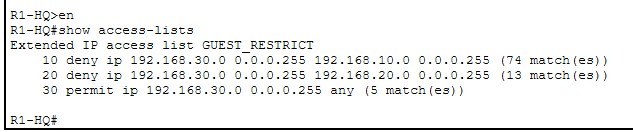
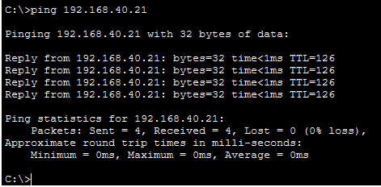
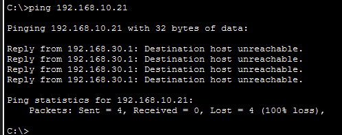

# Enterprise Network Design

This project is a Cisco Packet Tracer enterprise network design that demonstrates VLAN segmentation, inter-site routing, trunking, OSPF dynamic routing, and ACL-based access control.

## Project Overview

The network connects an HQ site and a Branch site using routers, switches, and multiple VLANs. The HQ network is segmented into ADMIN, IT, and GUEST VLANs. OSPF is used for dynamic routing between HQ and Branch. Extended ACLs are configured to restrict Guest VLAN access to Admin and IT networks while still allowing access to the Branch network.

## Technologies Used

- Cisco Packet Tracer
- VLANs
- 802.1Q Trunking
- OSPF Routing
- Extended ACLs
- Cisco IOS CLI

## Network Design

### Devices

- 2 Routers
- 2 Switches
- 4 PCs
- 3 VLANs

### VLANs

| VLAN | Name | Network |
|---|---|---|
| 10 | ADMIN | 192.168.10.0/24 |
| 20 | IT | 192.168.20.0/24 |
| 30 | GUEST | 192.168.30.0/24 |
| 40 | BRANCH | 192.168.40.0/24 |

## Key Features

- Multi-site HQ and Branch topology
- VLAN segmentation for security and management
- OSPF dynamic routing between routers
- Trunking configured on switch uplink
- Guest VLAN restricted from accessing Admin and IT networks
- Guest VLAN allowed to reach Branch network
- Connectivity validated using ping tests, OSPF neighbors, routing tables, and ACL hit counts

## Validation Screenshots

### Overall Topology



### VLAN Configuration


### Trunk Configuration


### OSPF Neighbor


### Routing Table


### ACL Hit Counts



### Guest Allowed to Branch



### Guest Denied to Admin



## How to Open the Project

1. Download and install Cisco Packet Tracer.
2. Download or clone this repository.
3. Open the `.pkt` file in Cisco Packet Tracer:

```text
Enterprise-Network-Design.pkt